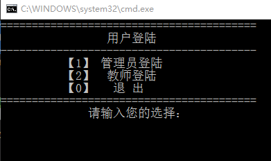

# Student-management-system
C学生信息管理系统
### 一、需求分析
#### 1、某学校有本科生和研究生两类学生。  
A. 本科生信息：学号、姓名、性别、专业、年级、班级、高数成绩、英语成绩、C语言、总成绩、班级排名、年级排名。其中：学号、姓名、性别、专业、年级、班级、高数成绩、英语成绩、C语言成绩为输入项，总成绩是计算项，班级排名是总成绩在班内名次，年级排名是总成绩在同专业、同年级内名次。  
B. 研究生信息：学号、姓名、性别、专业、年级、班级、课程综合成绩、论文成绩、总成绩、班级排名、年级排名。其中：学号、姓名、性别、专业、年级、班级、课程综合成绩、论文成绩为输入项，总成绩是计算项，班级排名是总成绩在班内名次，年级排名是总成绩在同专业、同年级内名次。  
说明：成绩基本信息：科目门数、科目成绩（动态数组或指针）。专业基本信息：专业编号、专业名称，学生必须归属于某个专业，学生与专业通过“专业编号”关联起来。班级基本信息：班级编号、班级名称、班级人数、专业编号，学生必须归属于某个班级，学生与班级通过“班级编号”关联起来，班级与专业通过“专业编号”关联起来。  

#### 2、学生总成绩计算方法。
A．本科生：总成绩=高数成绩+英语成绩+C语言成绩；  
B．研究生：总成绩=课程综合成绩+论文成绩；  
请使用面向对象程序设计方法，开发一个学生成绩管理系统对学生成绩进行有效管理。  
### 二、系统的功能要求  
1.专业管理：包括专业基本信息的添加、修改、删除、查询功能。学生必须归属于某个专业。  
2.班级管理：包括班级基本信息的添加、修改、删除、查询功能。学生必须归属于某个班级。  
3.添加功能：分本科生和研究生两类人员，实现下列添加功能。  
A．本科生：能够添加学生信息，如果高数成绩、英语成绩、C语言成绩都输入，则系统自动计算总成绩。  
B．研究生：能够添加学生信息，如果课程综合成绩、论文成绩都输入，则系统自动计算总成绩。  
4.修改功能：分本科生和研究生两类人员，实现下列修改功能。  
A．本科生：根据学号来修改任意学生的除学号外的信息。如果高数成绩、英语成绩、c语言成绩都存在，则系统自动计算总成绩。  
B．研究生：根据学号来修改任意学生的除学号外的信息。如果课程综合成绩、论文成绩都存在，则系统自动计算总成绩  
5.删除功能：分本科生和研究生两类人员，能够根据学号删除一个学生。  
6.排名功能：分本科生和研究生两类人员，实现下列排名功能。  
说明：排名包括班级排名和年级排名，排名规则按体育竞赛规则处理，若出现两个并列第1名，下个名次为第3名，依此类推。  
A：班级排名：分本科生和研究生两类学生，计算每个学生总成绩在班级中的名次。  
B：年级排名：分本科生和研究生两类学生，计算每个学生总成绩在本专业、本年级中的名次。  
7.查询功能：分本科生和研究生两类人员，实现下列查询功能。  
1)能够按班级显示本班全部学生信息。  
2)能够根据学号或者姓名查询学生信息。  
3)能够在某个班级中查询某门课成绩不及格学生信息。  
8.排序功能：分本科生和研究生两类人员，实现下列排序功能。  
1)所有学生信息按学号从低到高排序并显示。  
2)某个班学生信息按总成绩从高到低排序并显示。  
9.统计功能：分本科生和研究生两类人员，实现下列统计与显示功能。  
1)统计某班级某课程的平均成绩、最高成绩、最低成绩。如果学生该门课没有成绩，统计平均成绩时忽略该生。  
2)统计某班级某课程超过课程平均成绩的学生名单及人数。  
3)统计某班级某课程不及格学生名单及人数。  
4)统计某班级某课程不同等级的学生人数。等级标准：优—大于等于90；良—大于等于80且小于90；中：大于等于70且小于80；及格：大于等于60且小于70；不及格：小于60。  

#### 部分运行截图

